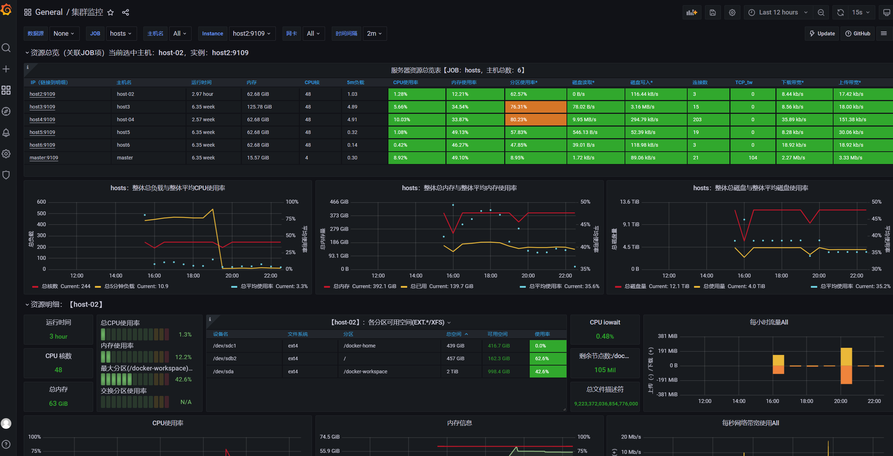
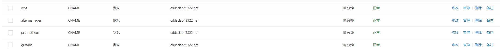

# 服务器监控部署

## 目的

实验室集群因在寒假期间使用内网穿透等原因被挖矿病毒攻击过，为了能及时发现服务器的异常情况搭建了实验室集群基于[prometheus](prometheus.dscl.team), [altermanager](altermanager.dscl.team), [grafana](grafana.dscl.team)的监控系统。本文文档主要用于介绍服务的部署和备份。

grafana效果图



## 安装步骤

### 软件安装

1. 在实验室集群各个节点安装 node exporter: master, host2, host3, host4, host5, host6。

   1. 下载安装 node exporter linux [二进制文件](https://github.com/prometheus/node_exporter/releases/tag/v1.3.1)，并移动到 path 目录`/usr/local/bin/`下。

   2. 撰写 service 文件开机自启动。

      `systemctl enable prometheus_node_exporter`
      
      ```bash
      # cat /usr/local/lib/systemd/system/prometheus_node_exporter.service
      [Unit]
      Description=node_exporter
      After=network.target
      [Service]
      Type=simple
      User=root
      # 指定启动的端口和日志级别
      ExecStart=/usr/local/bin/node_exporter --web.listen-address=:9109 --log.level=error
      MemoryLimit=300M
      CPUQuota=100%
      Restart=on-failure
      [Install]
      WantedBy=multi-user.target
      ```

2. 创建配置文件夹 `/root/prometheus`并创建好对应的配置文件。

   ```bash
   ./
   ├── alertmanager.yml // alertmanager 告警配置：将实验室公用邮箱作为邮箱告警发送方，配置发送频率，接收告警的管理员邮箱地址等
   ├── alert_rules.yml  // prometheus 报警规则：对cpu使用率，内存使用率，设备温度等指标设置报警规则
   ├── grafana.ini      // grafana 配置文件，使用的是默认文件，挂载出来方便后续使用
   ├── prometheus.yml   // prometheus 配置文件，设置各个host节点的地址
   └── promtool         // promtool 二进制文件，./promtool check rules ./alert_rules.yml 可以检查规则文件的正确性
   ```

   具体的配置文件模板因内容较多，放在了文档末尾。

3. 使用 docker 在上述配置文件的基础上在 master 节点运行各个服务。

   * prometheus 

     ```bash
      docker run -itd  --name prometheus --restart=always -p 9099:9090 -v  /root/prometheus/prometheus.yml:/etc/prometheus/prometheus.yml -v /root/prometheus/alert_rules.yml:/etc/prometheus/alert_rules.yml  prom/prometheus   
     ```

   * grafana

     ```bash
     docker run -itd --restart=always -p 3000:3000 -v /root/prometheus/grafana.ini:/etc/grafana/grafana.ini grafana/grafana
     ```

   * alertmanager

     ```bash
     docker run -itd -p 9093:9093  --restart=always --name alertmanager -v /root/prometheus/alertmanager.yml:/etc/alertmanager/alertmanager.yml  prom/alertmanager  
     ```

   4. 使用dscl.team路径访问

      效果为 grafana.dscl.team -> cddsclab.f3322.net(路由器定时把最近ip通过DDNS告知f3322) -> nginx

      

    5. 在 master nginx 上面增加 prometheus, alermanager, grafana的转接。

       nginx配置是实验室各个服务的核心proxy，主要有

       * 实验室论坛，https ssl等
       * /home/dscl/dscl-web/ 实验室网站首页

       进master的`/etc/nginx/nginx.conf` include 的`/etc/nginx/etc/nginx/sites-enabled/default` 增加下面配置,记得`systemctl restart nginx`。

       ```bash
       # s3.dscl.team
       server {
               listen       80;
               server_name  s3.dscl.team;
               location / {
                  #client_max_body_size    1000m;
                          proxy_set_header X-Real-IP $remote_addr;
                  proxy_set_header HOST $http_host;
                  proxy_set_header X-NginX-Proxy true;
                  proxy_pass http://127.0.0.1:9000;
                  root   html;
                  index  index.html index.htm;
               }
       }
       
       # prometheus.dscl.team
       server {
               listen       80;
               server_name  prometheus.dscl.team;
               location / {
                  #client_max_body_size    1000m;
                          proxy_set_header X-Real-IP $remote_addr;
                  proxy_set_header HOST $http_host;
                  proxy_set_header X-NginX-Proxy true;
                  proxy_pass http://127.0.0.1:9099;
                  root   html;
                  index  index.html index.htm;
               }
       }
       
       # grafana.dscl.team
       server {
               listen       80;
               server_name grafana.dscl.team;
               location / {
                  #client_max_body_size    1000m;
                          proxy_set_header X-Real-IP $remote_addr;
                 proxy_set_header HOST $http_host;
                  proxy_set_header X-NginX-Proxy true;
                  proxy_pass http://127.0.0.1:3000;
                  root   html;
                  index  index.html index.htm;
               }
       }
       
       # alertmanager.dscl.team
       server {
               listen       80;
               server_name alertmanager.dscl.team;
               location / {
                  #client_max_body_size    1000m;
                          proxy_set_header X-Real-IP $remote_addr;
                  proxy_set_header HOST $http_host;
                  proxy_set_header X-NginX-Proxy true;
                  proxy_pass http://127.0.0.1:9093;
                  root   html;
                  index  index.html index.htm;
               }
       }
       
       # wps.dscl.team
       server {
               listen       80;
               server_name wps.dscl.team;
               location / {
                  #client_max_body_size    1000m;
                          proxy_set_header X-Real-IP $remote_addr;
                  proxy_set_header HOST $http_host;
                  proxy_set_header X-NginX-Proxy true;
                  proxy_pass http://host6:80;
                  root   html;
                  index  index.html index.htm;
               }
       }
       ```

   	6.  在 master 中实验室论坛静态页面上增加新增服务的跳转链接。
·		增加内服服务选项
         `/home/dscl/dscl-web/index.html` 里面的内部服务增加几个项目

### grafana配置

在进行完以上步骤后，需要对 grafana 进行配置，根据参考文件提示的步骤操作即可。

目前使用的模板是([模板市场](https://grafana.com/grafana/dashboards/))：

* 中文，方便查看多台设备，缺少温度，[8919](https://grafana.com/grafana/dashboards/8919) 
* 英文，node exporter下载量最高，[1860](https://grafana.com/grafana/dashboards/1860)

### 参考文献：

* [运维监控系列（6）-Prometheus+Grafana监控多台Linux服务器](https://blog.csdn.net/qq_43437874/article/details/120355246)
* [Prometheus监控+Grafana+Alertmanager告警安装使用 (图文详解) ](https://www.cnblogs.com/jiujuan/p/13262380.html)

## 备份

监控服务 node_exporter 上报的数据会被 prometheus 存储起来，这个目录暂时没有挂载出来，如果需要备份，需要对这个目录进行挂载。监控主要是为了发现集群近期的问题，暂时觉得没有必要对过去数据进行保留，如果服务出现问题，重新安装部署步骤进行部署即可。

## 其他可能

ehds 同学提示 alertmanager 能够通过 webhook 协议把告警信息发到飞书、企业微信等设备中。

* 发现有这么一个比较重的[全家桶](https://github.com/feiyu563/PrometheusAlert)，如有需要可以搭建。

## 配置文件

* alertmanager.yml

```yaml
global:
  resolve_timeout: 5m
  smtp_from: 'cddscl@163.com' # 实验室告警邮箱使用的是163
  smtp_smarthost: 'smtp.163.com:25'
  smtp_auth_username: '<account>@163.com'
  smtp_auth_password: '<secret>'
  smtp_require_tls: false
  smtp_hello: '163.com'
route:
  group_by: ['alertname']
  group_wait: 5s
  group_interval: 5s
  repeat_interval: 5m
  receiver: 'email'
receivers:
- name: 'email'
  email_configs:
  - to: ['<admin1>@xxx.com', '<admin2>@xxx.com'] # 管理员邮箱
    send_resolved: true
inhibit_rules:
  - source_match:
      severity: 'critical'
    target_match:
      severity: 'warning'
    equal: ['alertname', 'dev', 'instance']
```

*  alert_rules.yml

  更多[prometheus 告警规则](https://blog.51cto.com/shoufu/2561994)

```yaml
groups:
- name: example
  rules:

  # Alert for any instance that is unreachable for >5 minutes.
  - alert: InstanceDown
    expr: up == 0
    for: 5m
    labels:
      severity: page
    annotations:
      summary: "Instance {{ $labels.instance }} down"
      description: "{{ $labels.instance }} of job {{ $labels.job }} has been down for more than 5 minutes."

  # Alert for any instance that has a median request latency >1s.
  - alert: APIHighRequestLatency
    expr: api_http_request_latencies_second{quantile="0.5"} > 1
    for: 10m
    annotations:
      summary: "High request latency on {{ $labels.instance }}"
      description: "{{ $labels.instance }} has a median request latency above 1s (current value: {{ $value }}s)"

  - alert: HostCPU
    expr: 100 * (1 - avg(irate(node_cpu_seconds_total{mode="idle"}[2m])) by(instance)) > 95
    for: 5m
    labels:
      serverity: high
    annotations:
      summary: "{{$labels.instance}}: High CPU Usage Detected"
      description: "{{$labels.instance}}: CPU usage is {{$value}}, above 95% for more than 5 minutes"

  - alert: HostMemory
    expr: (node_memory_MemTotal_bytes - node_memory_MemAvailable_bytes) / node_memory_MemTotal_bytes * 100 > 95
    for: 5m
    labels:
      serverity: middle
    annotations:
      summary: "{{$labels.instance}}: High Memory Usage Detected"
      description: "{{$labels.instance}}: Memory Usage i{{ $value }}, above 95% for more than 5 minutes"

  - alert: HostDiska
    expr: 100 * (node_filesystem_size_bytes{fstype=~"xfs|ext4"} - node_filesystem_avail_bytes) / node_filesystem_size_bytes > 90
    for: 5m
    labels:
      serverity: high
    annotations:
      summary: "{{$labels.instance}}: High Disk Usage Detected"
      description: "{{$labels.instance}}, mountpoint {{$labels.mountpoint}}: Disk Usage is {{ $value }}, above 90% for more than 5 minutes"

  # https://blog.51cto.com/shoufu/2561994
  - alert: HostPhysicalComponentTooHot
    expr: node_hwmon_temp_celsius > 40
    for: 5m
    labels:
      severity: warning
    annotations:
      summary: "Host physical component too hot (instance {{ $labels.instance }})"
      description: "Physical hardware component too hot\n  VALUE = {{ $value }}\n  LABELS: {{ $labels }}"
```

* grafana

  ```ini
  # grafana.ini
  # 默认配置即可
  ```

* prometheus.yml

  ```yaml
  # my global config
  global:
    scrape_interval: 15s # Set the scrape interval to every 15 seconds. Default is every 1 minute.
    evaluation_interval: 15s # Evaluate rules every 15 seconds. The default is every 1 minute.
    # scrape_timeout is set to the global default (10s).
  
  # Alertmanager configuration
  alerting:
    alertmanagers:
      - static_configs:
              - targets: ["master:9093"]
            #           - alertmanager:9093
  
  # Load rules once and periodically evaluate them according to the global 'evaluation_interval'.
  rule_files:
      - "/etc/prometheus/alert_rules.yml"
    # - "second_rules.yml"
  
  # A scrape configuration containing exactly one endpoint to scrape:
  # Here it's Prometheus itself.
  scrape_configs:
    # The job name is added as a label `job=<job_name>` to any timeseries scraped from this config.
    #- job_name: "prometheus"
  
      # metrics_path defaults to '/metrics'
      # scheme defaults to 'http'.
  
      # static_configs:
      #  - targets: ["localhost:9010"]
    # host2-host6 集群监控
    - job_name: "hosts"
  
      # metrics_path defaults to '/metrics'
      # scheme defaults to 'http'.
      static_configs:
        - targets: ["host2:9109","host3:9109","host4:9109","host5:9109","host6:9109","master:9109"]
  ```

